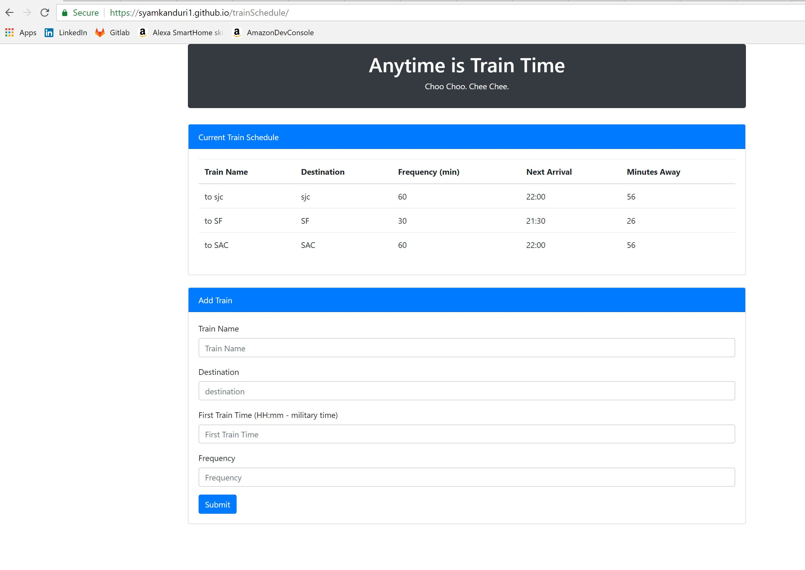

# Train Schedule Assignment

<!-- Put the name of the project after the # -->
<!-- the # means h1  -->
# Homework # 7- Train Schedule Assignment

<!-- Put a description of what the project is -->
To develop a small application that maintains train schedule using javascript, jQuery and html. 

# Link to deployed site
<!-- make a link to the deployed site --> 
<!-- [What the user will see](the link to the deployed site) -->
[my sixth homework](https://syamkanduri1.github.io/trainSchedule/)


# Images
<!-- take a picture of the image and add it into the readme  -->
<!--  -->



# technology used
<!-- make a list of technology used -->
<!-- what you used for this web app, like html css -->

html, css, jQuery, javascript
<!-- 
1. First ordered list item
2. Another item
⋅⋅* Unordered sub-list. 
1. Actual numbers don't matter, just that it's a number
⋅⋅1. Ordered sub-list
4. And another item. 
-->


# code snippets
<!-- put snippets of code inside ``` ``` so it will look like code -->
<!-- if you want to put blockquotes use a > -->

```
following lines of code calculate next arrival time and minutes away from current time.
    

  firstTrainTime = moment(firstTrainTime, "HH:mm").subtract(1, "years");
  timeDiff = moment().diff(moment(firstTrainTime), "minutes");
  trainRemainder = timeDiff % snap.frequency;
  minutesAway = snap.frequency - trainRemainder;
  nextArrivalTime = moment().add(minutesAway, "m").format("HH:mm");
```


# Learning points
<!-- Learning points where you would write what you thought was helpful -->
moment.js!!

# Author 
Syam Kanduri

# License
Standard MIT License